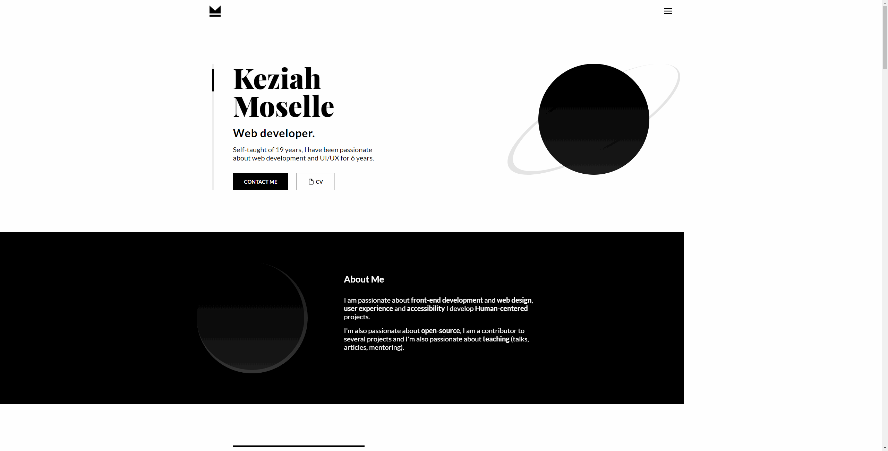
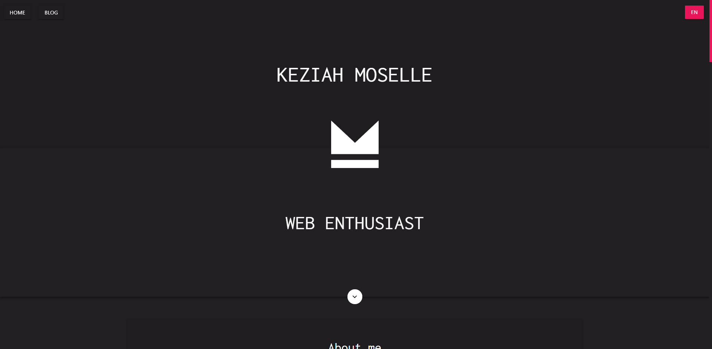
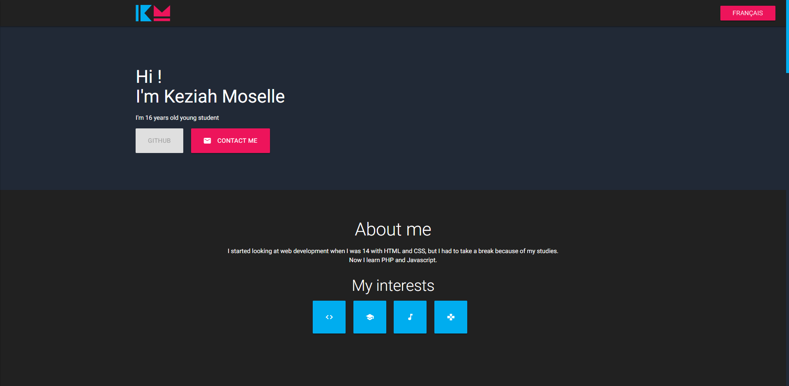
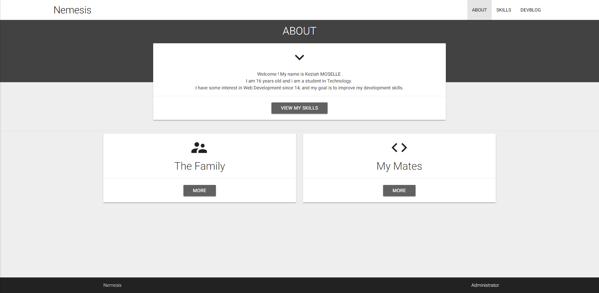
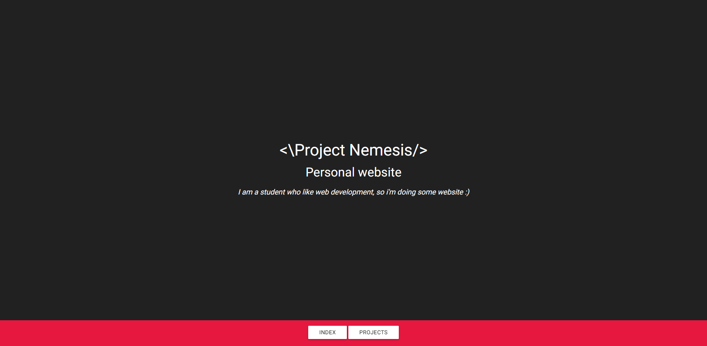

<p align="center">
  
</p>


<h3 align="center"><a href="https://keziahmoselle.fr/">keziahmoselle.fr</a></h3>


<p align="center">
  <a href="https://app.netlify.com/sites/keziahmoselle/deploys"></a>
</p>

---

## Install

1. Install dependencies
```sh
> yarn
```

2. Run Next and Netlify functions
```sh
> yarn dev
```
Open [http://localhost:3000/](http://localhost:3000/)

3. Run only Next

```sh
> yarn start
```

Open [http://192.168.0.12:3000/](http://192.168.0.12:3000/)


## Build

To build the App and the Netlify function run :
```sh
> yarn build
```

`/out` and `/functions` will be generated.

## Archive

- **v2** (2019) [preview](https://keziahmoselle.fr/)
<p align="center">
  
</p>

- v1 (2018) [preview](https://5c61cc3acb9cd0000840a695--keziahmoselle.netlify.com/)
<p align="center">
  
</p>
- beta (2017)
<p align="center">
  
</p>
- alpha 2 (2016-2017)
<p align="center">
  
</p>
- alpha (2015-2016)
<p align="center">
  
</p>
